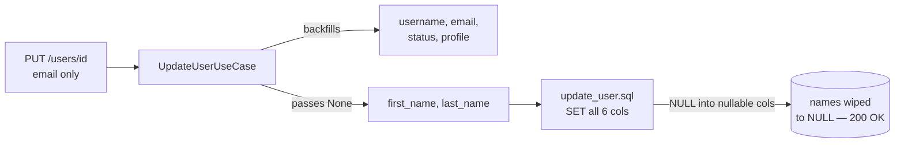

# OXA-000015 — `update_user` overwrites every column: omitted first/last name silently wiped to NULL; `username: None` hits the NOT NULL violation

**Original ID:** DATA-2 · **Severity:** P1 · **Type:** bug · **Status:** open
**Review tier:** Tier 4 (moderate — multi-file recipes, pinned-test flips) · reviewed 2026-09-30 · REJECTED — **wontfix by owner: full-row-replace `PUT /users/{id}` is by design**. Claims verified intact at HEAD (silent name-wipe on partial PUTs, unrecoverable — no history tables). Residual inconsistency recorded for the future reader: the service layer backfills 4/6 fields (username/email/status/profile), a partial-update affordance that replace-semantics doesn't need; if the design ruling is ever made explicit in code, those backfills are the thing to strike. Sibling OXA-000016 reviewed separately.


## Locations

All paths relative to `src/oxidauth/` unless noted. Verified against the working tree 2026-09-29.

The product defect is a pair of half-measures:

- `oxidauth-postgres/src/users/update_user/update_user.sql:1-10` — the whole statement is an unconditional full-row overwrite: `SET username = $2, email = $3, first_name = $4, last_name = $5, status = $6, profile = $7 WHERE id = $1 RETURNING *`. No `COALESCE`, no dynamic SET.
- `oxidauth-postgres/src/users/update_user/mod.rs:18-27` — binds all six fields straight from `UpdateUser` and `fetch_one`s the result; whatever `Option::None` arrives becomes a SQL NULL write.
- `oxidauth-services/src/users/update_user.rs:46-60` — `UpdateUserUseCase::update_user` loads the current row (`:41-44`) and backfills **four** fields when `None`: `username` (`:46-48`), `email` (`:50-52`, bare `params.email = current.email`), `status` (`:54-56`), `profile` (`:58-60`). **`first_name`/`last_name` are never touched** — they pass through `None` into the SQL above (`:62-64`).

Schema (why the two failure modes differ):

- `oxidauth-postgres/migrations/20221019185709_create_users.sql:5,4,9` — `username VARCHAR(64) NOT NULL UNIQUE`, `status VARCHAR(32) NOT NULL`, `profile JSONB NOT NULL DEFAULT '{}'::jsonb` → `None` on these *errors*.
- `oxidauth-postgres/migrations/20221019185709_create_users.sql:6-8` — `email`, `first_name VARCHAR(64)`, `last_name VARCHAR(64)` are all **nullable** → `None` on these *succeeds* and destroys data. No later migration alters the users table (grep over `migrations/`: only FK references to `users(id)`; no trigger defines `updated_at` either).

Callers that reach the defect:

- `oxidauth-api/src/server/api/v1/users/update_user.rs:42-54` — `PUT /api/v1/users/{user_id}` (mounted `users/mod.rs:28`) copies every optional body field (`oxidauth-http/src/users/update_user.rs:17-24`, all `Option`) verbatim into `UpdateUser`; failures answer `400` (`:71`).
- `oxidauth-kernel/src/invitations/accept_invitation.rs:38-51` — `From<(Uuid, &AcceptInvitationUserParams)> for UpdateUser` passes `first_name`/`last_name`/`email`/`status`/`profile` verbatim from the request body; `oxidauth-services/src/invitations/accept_invitation.rs:78-83` then calls the *same* `UpdateUserService`. Route: `POST /api/v1/invitations/{invitation_id}` (`api/v1/invitations/mod.rs:16`) — the invitee-facing flow.
- Direct repository callers of `UpdateUserQuery` (`oxidauth-repository/src/users/update_user.rs:11-19`) bypass the backfill entirely; in the current tree the only non-test caller is the use case (`oxidauth-api/src/provider/services.rs:157-168` wires `SelectUserByIdQuery` + `PgUserRepository`).
- Response shape: `oxidauth-postgres/src/users/mod.rs:29-59` — `UserRow.first_name/last_name` are `Option<String>`, so a wiped name decodes cleanly to `null` in every response. No read-path error; the loss is silent on both ends.

**Register drift (verified, not assumed):** both cited line numbers point at `BUG(pinned)` test markers, per the pattern confirmed for every register item so far:

- `oxidauth-postgres/src/users/update_user/:105` → the marker *inside the test module* at `mod.rs:105-108` (`it_should_reject_null_username_overwrite`). The product defect is `update_user.sql:1-10` + `mod.rs:18-27`.
- `oxidauth-services/src/users/update_user.rs:235` → the marker inside `omitted_fields_are_backfilled_from_the_current_row` (`:235-238`). The product defect is the missing name backfill at `:46-60`.
- "migration 20221019…" = `20221019185709_create_users.sql:7-8`; confirmed both name columns nullable, exactly as the register says.
- The substantive claims are all **true** as written (backfill covers username/email/status/profile only; SQL overwrites every listed column; omitted name → silent NULL), and `missing-tests.md:324,546` independently re-verified them.

Related-but-separate, same route (do not fix here): the SDK wrapper sends `POST` where the api mounts `PUT` — `oxidauth-rs/src/client/users/update_user.rs:32` + `BUG(pinned)` at `:69-71` — so today the *native SDK's* update_user 405s against a live server; every other client (raw HTTP, hurl) reaches the wipe.

## Problem

`PUT /api/v1/users/{id}` with a body like `{"user": {"email": "new@example.com"}}` — the obviously-intended partial update, and the shape the all-`Option` DTO advertises — does two different wrong things depending on which fields are omitted:

1. **Silent data loss (the P1):** omit `first_name`/`last_name` (or send `"first_name": null`) and, because the service backfills everything *except* the names while the SQL writes every column, the stored names are overwritten with NULL — permanently, with a `200` response echoing the now-empty names. One careless `PUT` wipes a user's identity fields.
2. **Update impossible at the repository level:** omit `username` (or `status`, or `profile`) on a direct repo call and the write attempts NULL into a `NOT NULL` column — `update_user` *fails* instead of leaving those columns alone. The service masks this only for the four fields it backfills; `it_should_reject_null_username_overwrite` pins the raw failure.

Via `accept_invitation`, every invitation acceptance whose body omits the names (`first_name`/`last_name` are `Option` in `AcceptInvitationUserParams`) also nulls them on the existing user row before creating the authority.



## Analysis

**Mechanism.** The wire model is `Option<T>` = "field not supplied" (serde deserializes both omission and JSON `null` to `None` — the DTO cannot distinguish them even today). The SQL then interprets every parameter as "the new value", so "absent" and "value" are conflated at the boundary. The service was written to paper over the conflation (read-modify-write at `:41-60`) but the read-modify-write list is incomplete — the two name fields were left out, so exactly the fields whose columns are nullable (i.e. where a NULL write is *accepted*, not caught) are the ones left unbackfilled. The NOT NULL columns fail loudly; the nullable columns fail silently.

**Asymmetry with sibling code.** `oxidauth-postgres/src/authorities/update_authority/update_authority.sql:2-9` has the identical overwrite structure (DATA-3, filed as OXA-000016) — and it *does* set `updated_at = NOW()`. `update_user.sql` does not touch `updated_at` and no trigger exists (grep over `migrations/` for `TRIGGER`: zero hits), so even a successful user update leaves a stale `updated_at` — a second, smaller defect in the same statement, worth one line in the same fix.

**Edge cases and adjacent findings (verified):**

- **`profile` is `NOT NULL` too** (`create_users.sql:9`). Direct-repo `profile: None` fails the same way as username; the service masks it only because `:58-60` backfills it. Any fix that only backfills names in the service (register's literal reading) leaves the repository-level class unfixed.
- **Explicit `null` is indistinguishable from omission at every layer.** `serde_json` maps both to `None` (`oxidauth-http/src/users/update_user.rs:17-24` has no `skip_serializing_if`/`deny_unknown_fields` anywhere in the workspace), so there is *currently no way to express "clear my email"* through this API. A `COALESCE` fix therefore removes no expressible capability — it only pins "absent means keep". (The pre-fix repository-level behavior of clearing via `None` is not reachable through the HTTP API: the service backfills email.)
- **The service mutates the caller's `params` in place** (`&mut UpdateUser`, `:40`) so the backfilled values are visible after the call; the invitation `From` impl (`accept_invitation.rs:38-51`) constructs a fresh struct per call, so no cross-request aliasing hazard exists for the added lines.
- **Email-merge nuance:** email backfills as `params.email = current.email` (bare), so a row with no email still forwards `None` — pinned by `omitted_email_on_a_row_without_email_stays_absent` (`:272-289`). With the SQL fix that `None` becomes "keep" instead of "rewrite NULL" — same observable result *for email* (it was already NULL), so the pin's unit-level assertion survives unchanged; the names need no bare/`Some` distinction at all since both service `User` and `UserRow` store `Option<String>` (`oxidauth-postgres/src/users/mod.rs:36-37`, `oxidauth-services` captures `Option`).
- **hurl's own PUT leg is a witness, not a guard:** `hurl/tests/users.hurl:115-132` partial-PUTs `email`+names and asserts `username`/`status` survived (proving the four backfills), but it always supplies both names, so the wipe path has zero e2e coverage today.
- **accept_invitation compounds it:** the flow is `POST /api/v1/invitations/{invitation_id}` (`api/v1/invitations/mod.rs:16`) → delete invitation → create user authority → `update_user` (`services/accept_invitation.rs:52-86`). An invitee posting `{username, email, user_authority}` only (names optional) wipes any names previously on their row. OXA-000009 Step 3 separately proposes dropping `status` from that mapping (status must not be invitee-supplied); the name-wipe here is fixed orthogonally by this ticket and that removal does not interact.
- **Silent on the read side:** wiped names decode `Option::None` (`oxidauth-postgres/src/users/mod.rs:43-59`) — contrast DATA-3, where the NULL write *also* corrupts a later decode. Here nothing errors after the damage; the only trace is the `200` response body echoing `first_name: null`.

**Who is affected.** Every operator and integration that partial-PUTs a user (the DTO invites it); every invitation acceptance that omits names; any future caller using `PgUserRepository` + `UpdateUser` directly hits the NOT NULL error class on `username`/`status`/`profile`. `missing-tests.md:34` already lists "`update_user` silently NULLs omitted first/last names" among the audit's headline pinned bugs.

## Impact

- **Data:** permanent, unrecoverable loss of `first_name`/`last_name` (no audit/history table exists anywhere in `migrations/`, so there is nothing to restore from). One malformed or well-meaning `PUT` per user, no error, no log beyond an `info!` "successfully updated user" (`api/.../update_user.rs:58-61`).
- **Availability/functionality:** the repository-level path cannot express a partial update at all — `username`/`status`/`profile` omissions error with a raw sqlx NOT NULL violation surfaced as `400` to API callers (only the service backfill prevents that via HTTP, so any regression there is one refactor away).
- **Trust/UX:** clients reasonably treat `200` + echoed user as "my patch applied"; discovering the wipe requires reading the payload. GDPR/identity-adjacent: silently blanking display names on managed accounts.
- **No compatibility downside to the fix direction** — see resolution: "None means keep" matches what every reachable caller already means by `None`.

## Proposed resolution

Two coordinated half-fixes, mirroring the DATA-3/OXA-000016 treatment for authorities. **One owner per SQL file:** this ticket owns `users/update_user.sql`; `authorities/update_authority.sql` belongs to OXA-000016's owner — land both with the same COALESCE convention but do not let one change touch the other's file.

**Step 1 — make the SQL patch-safe (`oxidauth-postgres/src/users/update_user/update_user.sql`):**

```sql
UPDATE users
SET
    username   = COALESCE($2, username),
    email      = COALESCE($3, email),
    first_name = COALESCE($4, first_name),
    last_name  = COALESCE($5, last_name),
    status     = COALESCE($6, status),
    profile    = COALESCE($7, profile),
    updated_at = NOW()
WHERE id = $1
RETURNING *
```

- Same statement, same bind order — `oxidauth-postgres/src/users/update_user/mod.rs:18-27` needs **no Rust change** (binds are positional and unchanged).
- `updated_at = NOW()` is the incidental same-file fix, matching `update_authority.sql:9`; nothing in the tree asserts a preserved user `updated_at` (the only assertions are `exists` checks in `hurl/tests/users.hurl:62-63`), and no `BUG(pinned)` covers it. Flag it in the changelog as a behavior change (user `updated_at` finally becomes truthful).
- Alternative rejected for this cut: dynamic SQL via `sqlx::QueryBuilder` (true JSON-merge-patch semantics, supports explicit clears). It's the right shape *only if* the product ever wants "explicit null = clear" — see Step 3's decision record; COALESCE keeps the statement static and `query_as` typed.

**Step 2 — complete the service backfill (`oxidauth-services/src/users/update_user.rs`, insert after the email block at `:50-52`):**

```rust
if params.first_name.is_none() {
    params.first_name = current.first_name;
}

if params.last_name.is_none() {
    params.last_name = current.last_name;
}
```

`User.first_name/last_name` are `Option<String>` (`oxidauth-postgres/src/users/mod.rs:36-37` fills `oxidauth_kernel::users::User` via `:43-59`), so this is a bare move like the email line — no `Some(...)` wrap, and `current` is already moved out of the query at `:41-44`. The backfill stays *after* Step 1 in the same commit: it keeps the use-case contract explicit and preserves the captured-request unit tests' visibility; the COALESCE makes it belt-and-suspenders against direct repo callers.

**Step 3 — record the semantics decision (product owner, one paragraph):** with COALESCE + full backfill, `None` means **"leave the column alone"** at every layer. Consequence: clearing `email` (names are already non-meaningfully-clearable) becomes unexpressible. Today it is *already* unexpressible over HTTP (serde can't distinguish omission from `null`, and the service backfills email), so this locks in reality rather than removing capability. If "clear my email" ever becomes a requirement, introduce it explicitly then — `Option<Option<T>>` with serde or a per-field `clear` flag, handled in `sqlx::QueryBuilder` — not by silently weakening COALESCE. Changelog line: *"Partial `PUT /users/{id}` bodies no longer wipe omitted fields; repository-level `update_user` now treats NULL parameters as 'keep stored value'."*

**Step 4 — assess/repair the already-wiped data (operational, one-off):** historical names cannot be restored — the schema has no history (verified across all migrations). The honest repair is a discovery + re-population audit:

```sql
-- who has been hit (or never had names): the damage set is indistinguishable from never-set
SELECT id, username, email, (first_name IS NULL) AS no_first, (last_name IS NULL) AS no_last, updated_at
FROM users
WHERE first_name IS NULL OR last_name IS NULL;
```

Populate from the authoritative source per deployment (HR/IdP/invite records) via the now-safe admin `PUT`; leave genuinely-unknown names NULL (the columns stay nullable — do **not** add `NOT NULL` retroactively, that would fail on legitimately-nameless users, and in particular on machine accounts: `UserKind` is `{Human, Api}` (`oxidauth-kernel/src/users/mod.rs:30-34`) and `Api`-kind users have no display name by nature).

**Pinned-test handling (grep-verified).** Exactly two markers cover this item, plus one unlabeled overwrite assertion:

- `oxidauth-postgres/src/users/update_user/mod.rs:105-108` (`BUG(pinned)` in `it_should_reject_null_username_overwrite`, `:104-130`): **inverts.** Post-fix, `username: None` must *keep* `"update_me"`. Rewrite as `it_should_keep_stored_values_when_params_are_none`: seed, update with `username/email/first_name/last_name/status/profile` all `None`, assert the returned user equals the seeded row field-for-field and drop the marker. (`it_should_error_on_missing_user`, `:132-153`, is unaffected — `RowNotFound` still surfaces via `fetch_one`.)
- `oxidauth-postgres/src/users/update_user/mod.rs:85` (`assert_eq!(updated.email, None, "`None` must overwrite the column")` — **no marker**, but it pins the exact overwrite semantics this ticket flips): change to `assert_eq!(updated.email.as_deref(), Some("old@example.com"), "None must keep the stored value")`.
- `oxidauth-services/src/users/update_user.rs:235-240` (`BUG(pinned)` asserting `first_name: None, last_name: None` in `CapturedUpdate`): flip to `Some("Octavia".to_owned())` / `Some("Cat".to_owned())` — Step 2 makes them backfilled — and delete the marker comment; the test name `omitted_fields_are_backfilled_from_the_current_row` then finally describes the code.
- Survivors that must stay green: `omitted_email_on_a_row_without_email_stays_absent` (`:272-289`, unit-level capture of `params.email = current.email` — unchanged), `supplied_fields_win_over_the_current_row` (`:249-269`), the `accept_invitation` captured-`UpdateUser` suite (`oxidauth-services/src/invitations/accept_invitation.rs`, mock-based — unaffected), and the E5 verb pin at `oxidauth-rs/src/client/users/update_user.rs:69-71` (separate 405 item; do not flip here).

**Compat/migration:** no schema change, no new migration. Behavior changes to announce: (a) omitted fields on `PUT /users/{id}` are kept — strictly a fix for every reachable caller; (b) `users.updated_at` starts advancing on updates; (c) direct repository callers that *relied* on NULL-writes get keep-semantics — grep shows none outside tests. If OXA-000009 Step 3 (drop invitee-supplied `status`) lands as well, sequence either order; they touch disjoint lines of `accept_invitation.rs`'s mapping vs. `users/update_user.rs`'s backfill.

## Verification

No dedicated unit test currently proves the wipe end-to-end (the service test stops at the captured request; the postgres test stops at the username error), so land one at each level alongside the flips:

1. `cargo test -p oxidauth-postgres --lib users::update_user` (test DB, same harness as `src/oxidauth/database_test.sh`): flipped `it_should_reject_null_username_overwrite` (now preservation on all-`None`), flipped email assertion at `:85`, plus a new case `it_should_keep_omitted_names` — seed with names, update `email` only, assert names survive — that test fails (names NULL) on the unfixed tree and passes after Step 1.
2. `cargo test -p oxidauth-services --lib users::update_user` — flipped `BUG(pinned)` capture assertions (`first_name: Some("Octavia")`, `last_name: Some("Cat")`) fail against the unfixed backfill list and pass after Step 2.
3. `cargo test -p oxidauth-services --lib invitations::accept_invitation` and `--lib users::find_user_by_id` — regression: nothing else consumes `UpdateUser`.
4. e2e before/after against a live server: create a user with names (`POST /api/v1/users`), then `curl -s -X PUT $HOST/api/v1/users/$ID -H "Authorization: Bearer $jwt" -d '{"user":{"email":"patched@x.io"}}'` → **pre-fix**: `200` with `"first_name": null`; **post-fix**: `200` with `"first_name":"Hurl"`-style preserved names. Then `PUT` with `{"user":{"first_name":"Second"}}` → names change only on first_name. Extend `hurl/tests/users.hurl` (the existing PUT leg at `:115-132` is the template) with this email-only leg: `jsonpath "$.payload.user.first_name" == "Hurl"` — durable e2e coverage that would have caught the original bug.
5. `updated_at` leg in the same hurl file: capture `updated_at` before the PUT and assert the response's `updated_at` differs (`timestamp` gt), proving the added `updated_at = NOW()`.
6. `cargo test -p oxidauth-postgres --lib authorities::update_authority` — only as a cross-check that the sibling fix (OXA-000016) kept the same COALESCE convention; coordinate, one owner per SQL file.
